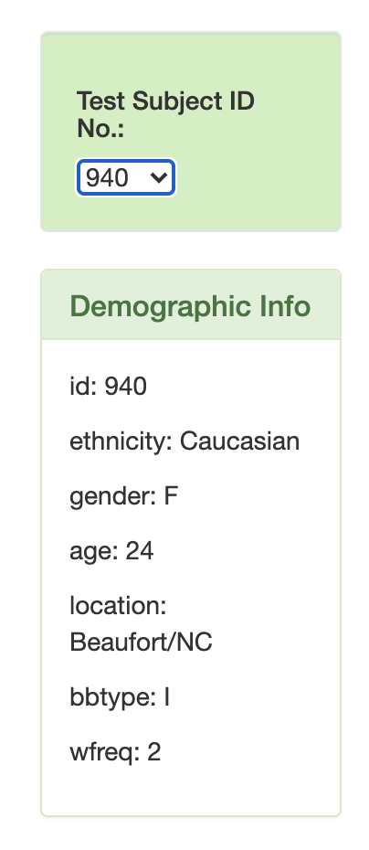
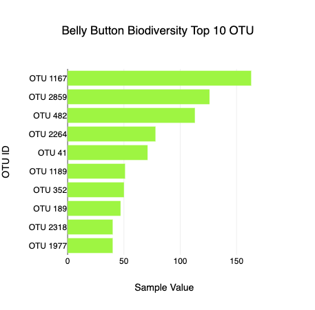
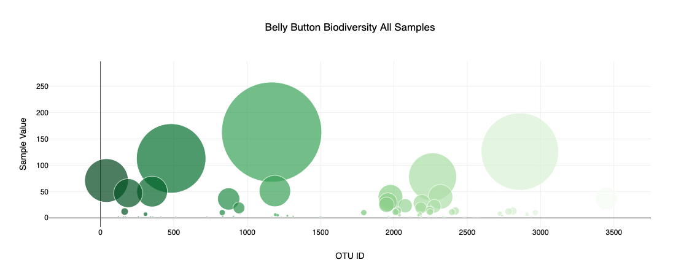
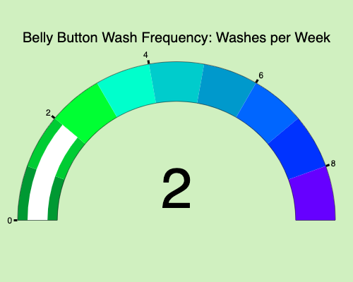

# plotly-challenge

Created by [Celeste Muniz - Lithgow](https://github.com/celeste1030)

## Table of Contents
* [Objective](#objective)
* [Steps](#steps)
* [Github Deployment](#github-deployment)
* [Technologies](#technologies)

## Objective

In this assignment, I built an interactive dashboard to explore the Belly Button Biodiversity dataset, which catalogs the microbes that colonize human navels.

It's a dirty job, but somebody's got to do it.

The dataset reveals that a small handful of microbial species (also called operational taxonomic units, or OTUs, in the study) were present in more than 70% of people, while the rest were relatively rare.

The dataset:
* [samples.json](samples.json)

## Steps

1. I populated a dropdown menu with all of the Sample ID's. When an option is selected, this will update all of the charts.

2. I created a horizontal bar chart to display the top 10 OTUs found in selected individual.

3. I created a bubble chart that displays each sample.

4. BONUS Challenge: I created a gauge chart to plot the weekly belly button washing frequency of the selected individual.

## Github Deployment 

## Technologies

Plot.ly

JavaScript

HTML

Bootstrap

